# Jeopardy Data Analysis
Personal Project for School By Cameron Dugan extension of group project with Josh Gifford

## About Jeopardy Data Analysis
This is a project which intends to find out the best areas of knowledge within jeopardy to train for to become the ultimate jeopardy champion. We also want to analize trends in player behavior to see if there's an advantage to be gained.

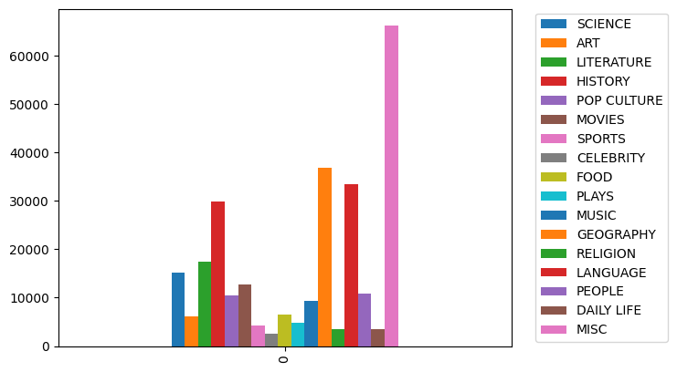

# Methods
Tools:
+ Numpy, Pandas
+ Github + Git
+ VS Code IDE with Jupyter + Python extensions

+ Vector Division

# Results
## Final Jeopardy
Below is a graph of the frequency of bets made during the final round of jeopardy. It spikes during round numbers because in general humans tend to prefer picking round numbers.

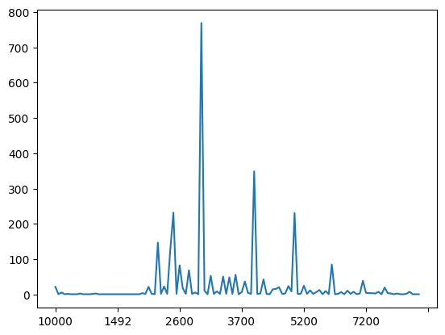

This next graph is using the final jeopardy questions put into our custom groups of categories. Our misc categories has shrunk indicating a more frequent use of broad stroke category names during the final round.

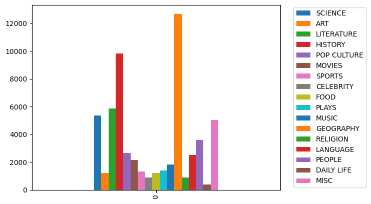

## Category Histogram
These are the categories displayed year by year, to provide a distinct look at the trends in category popularity over time.

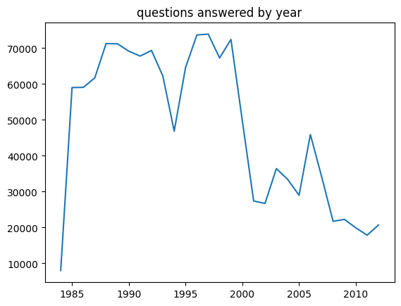

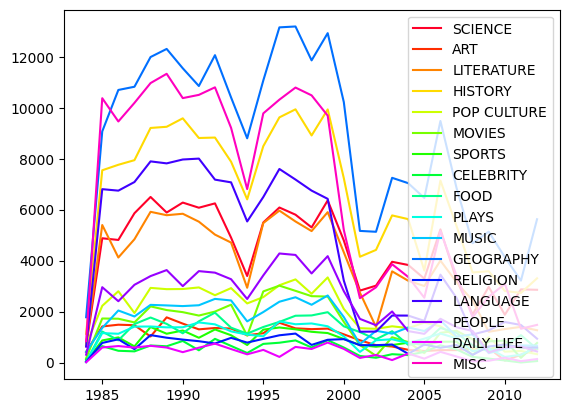

The following graphs are each category's relative popularity by year

Celebrity takes a dip in recent years

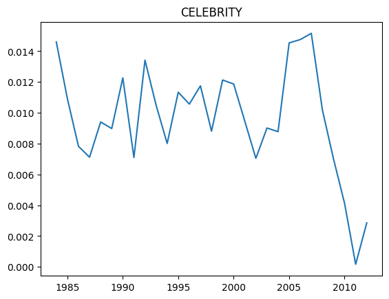

Daily life on a noisy downards trend

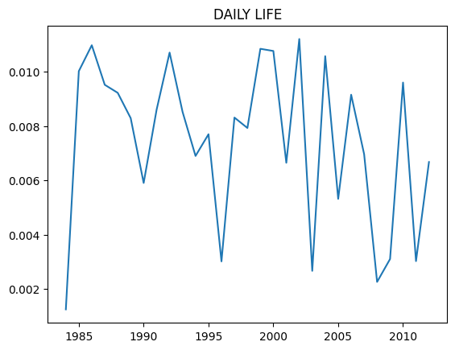

The food category is on a relatively steady incline

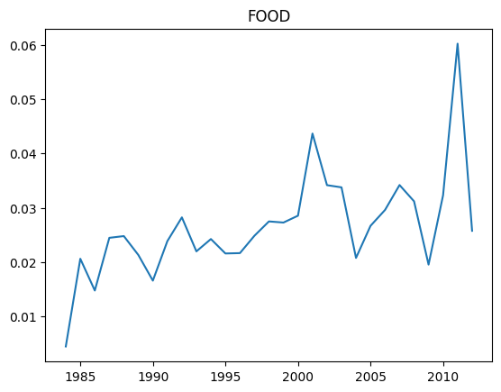

Geography has continued to become more popular as the show continues to air.

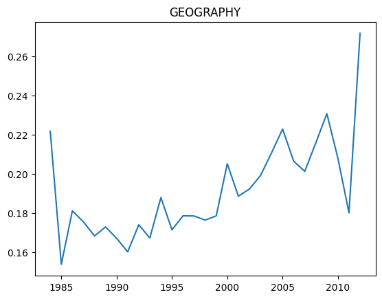

Language Dropped off just before y2k, and occassionally makes spur comebacks.

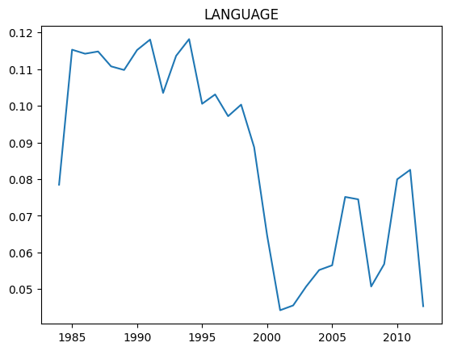

Movies dropped around y2k but grows pretty rapidly afterwords.

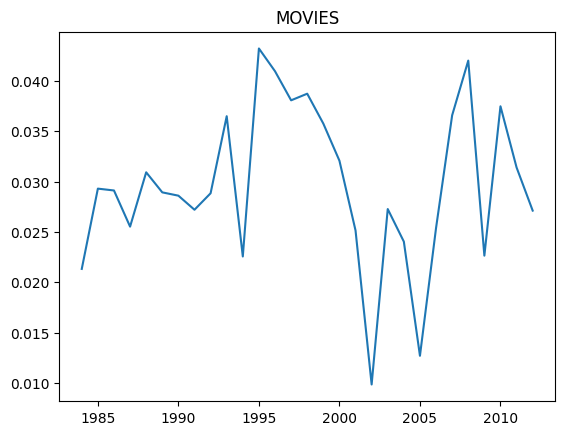

Music has some noise but is relatively stable.

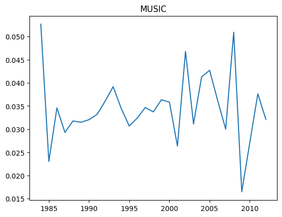

The people category has been in a constant decline since ~2003

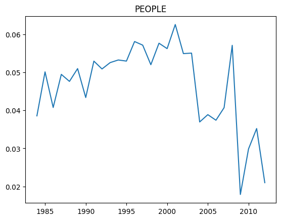

Plays seem to still be as relevent as they were when Jeopardy started.

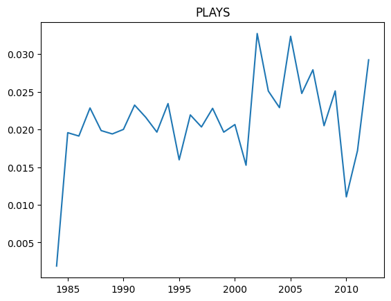

Pop Culture is most likely not going to be a category you want to study.

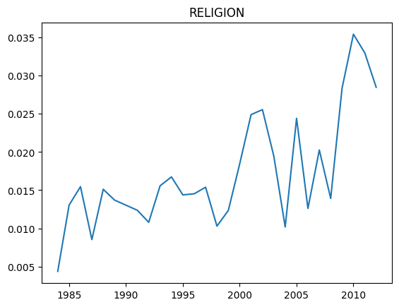

Science is definitely something to look into when studying to be a Jeopardy champion, looks like Science will continue to increase in popularity.

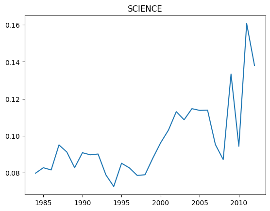

This graph, primarily tells us that Jeopardy as a whole is relying on broad sweeping categories more than many unique ones that don't necessarily fall into those larger knowledge categories.

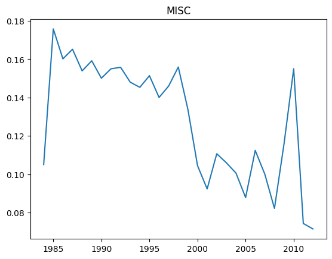

# Discussion
While evaluating the time based trends in the broad categories of Jeopardy I couldn't help but keep thinking about how long it would have taken to properly sort every existing category into a larger one, with each keyword added to our filtering system, the less results we ended up adding to our grouped categories.

With some exceptions, our categories timewise are highly fluctuating in popularity, and can highly impact the game. The types of knowledge that wins Jeopardy changes over time and to win in any given year requires different amounts of knowledge in each area.

# Summary

In Summary, to gain an advantage over your peers, you should study Science, Geography, Religion and avoid Celebrities, Language, and People because those categories are increasing in popularity.

[1] [Professor Memo's Example](https://github.com/memoatwit/dsexample)